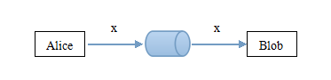
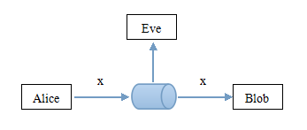
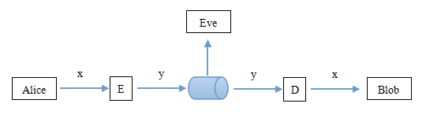
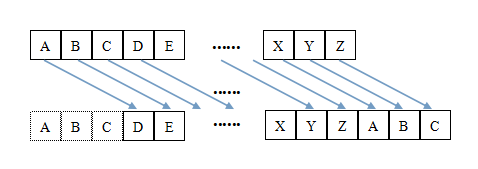
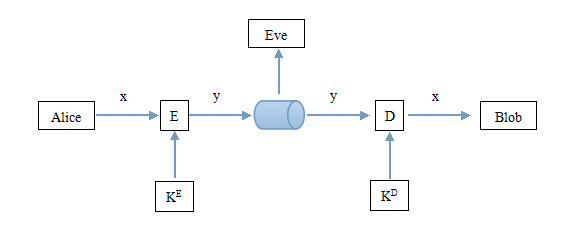
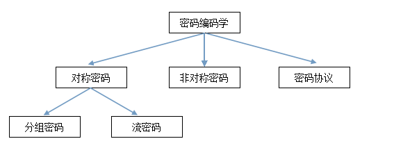

# 
 密码学基础概念 

- [通信](#通信)
- [窃听者](#窃听者)
- [加密与解密](#加密与解密)
- [密码编码学](#密码编码学)
- [密码分析学](#密码分析学)
- [加密算法的选择](#加密算法的选择)

## 通信
Alice和Bob是生活在21世纪的好友, 他们需要互相通信, 而通信媒介是多种多样的, 比如写信, 电话, Internet等等, 我们将他们使用的通信媒介称为**信道**. 而此时他们之间的通信, 可以表示如下图:  

  

## 窃听者
一切看起来都不错, Alice和Bob愉快的通信着, 直到有一天, 他们的通信内容不胫而走, 而他们并没有向别人提起过他们之间的通信内容, 很明显, 他们的信道是不安全的, 此时 **窃听者Eve** 出现了

   

不仅仅在21世纪, 早在千百年前, 人们就意识到, 需要对通信内容进行加密以防止泄露.  古希腊时期, 斯巴达军队使用密码棒进行换位加密[[1]](#ref1); 据《罗马十二帝王传》记载, 恺撒曾使用替换加密, 对重要的军事信息进行加密; 后世的维吉尼亚密码是使用一系列恺撒密码组成密码字母表.  
二战时期, 德军使用的[Enigma](../enigma/enigma.md)码加密军事信息, 在战争初期很好的为德军保护了通信消息, 而经过波兰和英国的密码破译者们的努力, 最终在战争的中后期被破解的故事, 也是不断的被搬上电影的荧幕.   
进入20世纪中后期, 密码学的发展更加迅速, 1977年1月15日, DES作为FIPS PUB 46发布; W.Diffie和M.Hellman 1976年在IEEE Trans.on Information刊物上发表了"New Direction in Cryptography", 提出了非对称密码的概念, 开创了密码学研究的新方向; Rijndael力压群雄, 被NIST选定为AES标准, 2001年11月26日发布于FIPS PUB 197.   

## 加密与解密
为了防止消息被泄露, Alice和Bob决定对消息进行加密操作, 有了前人的努力, 他们只需要选择他们认为合适的密码算法即可. 这一次, Alice先将消息进行**加密**(encrypt)操作, 再发送给Bob, 加密前的消息称为**明文**(plaintext), 加密后的消息称为**密文**(ciphertext). 而Bob收到来自Alice的消息之后, 需要先将消息**解密**(decrypt), 之后才能看见**明文**消息.  

   

此时, Eve虽然还是拿到了消息, 但是Eve拿到的是密文, 除非Eve能够破译消息, 否则Alice和Bob的通信就是安全的. 事情发展到了这里, 就进入了密码学的领域, 由Alice和Bob所代表的**密码编码学**, 以及**窃听者Eve**所代表的**密码分析学**互相促进和发展, 共同构成了密码学.  

## 密码编码学
刚刚提到过, Alice和Bob只需在现有的密码算法中, 选择一个合意的, 来对消息进行加解密即可, 那么密码算法是什么样, 由什么组成呢？ 这里举一个最为简单的例子: 恺撒密码, 来展示密码算法的轮廓.  
恺撒密码是一个简单的替换密码, 明文中所有字母按字母表上的顺序, 偏移一个固定的数目, 例如偏移3位时, A变成D, B变成E, ... X变成A, Y变成B, Z变成C.   

  

虽然恺撒密码早已不会在实际应用中使用, 但是通过它, 还是可以很方便的理解**密码编码**的思路: **密码算法** + **密钥**(key).  
在恺撒密码中, 位移映射这个方法被看作是**密码算法**, 而位移3位, 被看作是**密钥**. 通常情况下, 当Alice和Bob选定了一个合意的密码算法之后, 他们需要通过一个安全的信道, 协商好密钥, 之后每次的通信, 都使用这个密钥, 对明文进行加解密之后传输, 此时他们的通信如下图  

  

KE是加密密钥, KD是解密密钥  
* 当KE与KD相同时, 此时的加密方法称为**对称密码**(symmetric cryptography), [DES](../des/des.md), [AES](../aes/aes.md)等都是典型的对称密码  
* 当KE与KD不同时, 此时的加密方法称为**非对称密码**(asymmetric cryptography), 或者**公钥密码**(public-key cryptography), 典型的非对称密码有[RSA](../rsa/rsa.md)   

除了按照密钥分类之外, 还可以按照密码算法的类型来分成两类: **分组密码**(block cipher)和**流**(stream cipher), 这个先按住不表, 稍后再说. 密码编码学到现在, 大体的分支已经展示在我们的面前了  

  

## 密码分析学
在防御方发展的同时, 攻击方也在发展自己的理论, 由于本系列文章重点在讲述加解密, 所以密码分析学的内容, 只在这里带过一下. 
* 蛮力攻击法
  穷尽密钥搜索, 来还原所有可能的明文, 然后判断哪一个是正确的明文, 比如之前提到的恺撒密码, 由于所有可能的有效密钥只有26个, 我们称所有有效密码组成的集合为**密钥空间**, 以现在的计算机算力, 蛮力攻击可以轻松破解恺撒密码.  

刚刚提到过, 恺撒密码是一个简单的替换密码, 只使用位移作为密码, 稍微复杂一点的, 是在字母表间, 建立一一映射的关系, 此时字母A有26个选择, B有25个选择, 依此类推. 此时密钥空间的大小为:  

 密钥空间的大小 = 26 x 25 x ... x 3 x 2 x 1 = 26! 
  
得数在288到289之间, 即使只取288, 计算一句长16个字节的密文, 所需的计算量为292, 而当今(2020年)高端的个人电子计算机的CPU主频大都在4GHz, 如果使用单台计算机来暴力计算, 则需要百亿年才能计算完毕, 显然是不现实的.   

* 数学分析法
  蛮力攻击, 将密文也看作了一个黑盒, 显然是不可取的, 使用字母频率分析, 可以轻松的破解替换密码. 替换密码最大的缺点在于: 每个明文总是映射到相同的密文符号, 这就意味着明文的统计属性在密文中得到了很好的保留.   

后世为了解决替换密码的这种一一对应的缺点, 进行了很多的改进, 比如维吉尼亚密码, 以及二战时期, 德军使用的[Enigma](../enigma/enigma.md), 当然这些加密方式, 如今也都是不安全的了.  

除了上述提到的蛮力攻击和数学分析, 还有一些其他的方法, 比如:  
* 实时攻击
  通过旁路分析获取密钥, 比如功耗, 电磁辐射或算法运行时的行为, 都隐含着一定的密钥信息. 但是旁路攻击时建立在可以物理访问的基础上(比如智能卡), 因此当前的计算机通信, 一般不会考虑这种方法
* 社会学攻击
  可以通过行贿, 绑架或者欺骗来获取密钥, 比如经常在新闻报道中, 老年人收到电话, 电话那头谎称是公安, 要求老年人提供银行卡密码配合调查. (这里需要提一句, 我们平时所说的银行卡密码, 或者网站的登录密码, 并不是密钥，准确的说应该被称为口令(password)). 
  
## 加密算法的选择
在了解了密码分析之后, 作为非专业人员, 是否应该自己发明保密的密码算法来保证通信安全呢？  
结论是否定的, 开发高强度的密码算法是非常困难的, 试图通过对密码算法本身进行保密来确保安全性的行为, 称为隐蔽式安全性, 这种密码算法, 未经证明, 无法确认是否能够抵御住专业人员的攻击. 最好的办法是, 使用已经被全球广泛认可, 经受过专业人员攻击且证明是安全的密码算法, 而使用者只需保证密钥的安全即可.  

****
1. [Fred, Cohen. "A Short History of Cryptography." 1995](http://all.net/edu/curr/ip/Chap2-1.html)
