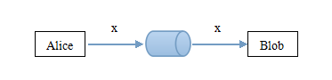
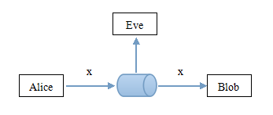

# 
 密码学基础概念 

#### 通信
**Alice**和**Blob**是生活在21世纪的好友, 他们需要互相通信, 而通信媒介是多种多样的, 比如写信, 电话, Internet等等, 我们将他们使用的通信媒介称为 **信道**. 而此时他们之间的通信, 可以表示如下图:  
  

#### 窃听者Eve
一切看起来都不错, **Alice**和**Blob**愉快的通信着, 直到有一天, 他们的通信内容不胫而走, 而他们并没有向别人提起过他们之间的通信内容, 很明显, 他们的信道是不安全的, 此时 **窃听者Eve** 出现了
  
为了防止消息被泄露, **Alice**和**Blob**决定对消息进行加密操作.   
不仅仅在21世纪, 早在千百年前, 人们就意识到, 需要对通信内容进行加密以防止泄露.  古希腊时期, 斯巴达军队使用密码棒进行换位加密[[1]](#ref1); 据<<罗马十二帝王传>>记载, 凯撒曾使用替换加密, 对重要的军事信息进行加密; 后世的维吉尼亚密码是使用一系列凯撒密码组成密码字母表.  
二战时期, 德军使用的Enigma码加密军事信息, 在战争初期很好的为德军保护了通信消息, 而经过波兰和英国的密码破译者们的努力, 最终在战争的中后期被破解的故事, 也是不断的被搬上电影的荧幕.   
进入20世纪中后期, 密码学的发展更加迅速, 1977年1月15日, DES作为FIPS PUB 46发布; Rijndael力压群雄, 被NIST选定为AES标准, 2001年11月26日发布于FIPS PUB 197. 

TODO: 未完待续

****
1. [Fred, Cohen. "A Short History of Cryptography." 1995](http://all.net/edu/curr/ip/Chap2-1.html)