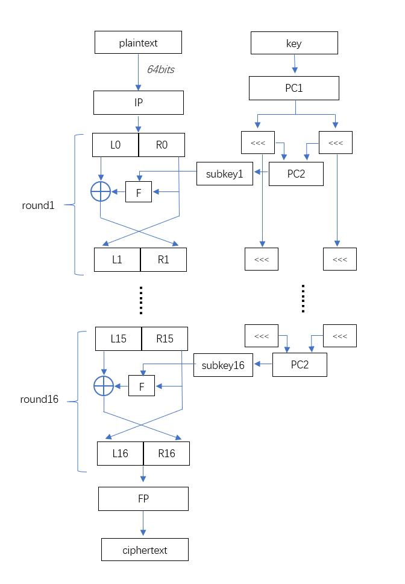

# 
 DES 

## DES历史简介
数据加密标准(Data Encryption Standard, 缩写为DES), 是一种对称密钥分组加密算法, 于20世纪70年代早期, 由IBM基于Horst Feistel的早期设计开发而来, 之后稍作修改的版本, 于1977年被美国联邦信息处理标准(FIPS)中所采用. DES现在已经不是一种安全加密的方法了, 除非需要向前兼容, 否则不推荐在实际项目中使用.  

## 密码学中的一些基础概念
正如上面的历史简介中提到的, DES是一种对称密钥的分组加密算法, 那么何为对称密钥, 何为分组加密呢?  

#### 对称密钥
使用密钥进行加/解密的算法, 大都可以抽象为下面的图形: 一个信息输入到加密算法中, 再输入对应的密钥, 经过加/解密, 得到输出信息  
  
而当加密和解密, 使用同一个密钥(Key)时, 称为对称加密;   
当加密和解密分别使用不同的密钥(Key)时, 称为非对称加密;    

#### 分组加密
分组加密(block cipher), 顾名思义, 就是每次只能处理一块特定长度的数据分组的加密算法, 就DES来说, 每次只会加密一块长度为64bit的数据, 当数据长于64bit时, 就会将数据切分成一堆长度为64bit的分组, 再输入到算法中进行处理. 但这里就出现了一个问题, 当其他条件不变时, 密钥(Key)相同, 输入块的数据也相同, 此时输出就相同, 而这样做法存在很大的安全漏洞(比如容易寻找规律, 无需破译就能操纵明文等). 所以就存在了分组加密的模式: ECB, CBC, CFB, OFB, CTR等.  

## DES整体结构
DES使用Feistel框架:   
  
* 将输入的64bit块分为各32bit的左右两块
* 在首尾各有一次置换, 称为初始置换(IP)和最终置换(FP), IP, FP互为反函数
* 中间是16轮次的Feistel处理过程, 将右32bit的数据与对应的子密钥输入Feistel函数, 输出的结果与左32bit进行异或(XOR)操作, 结果变为下一轮右32bit块, 而本轮的右32位块直接作为下一轮的左32bit块  

#### TODO: 未完待续