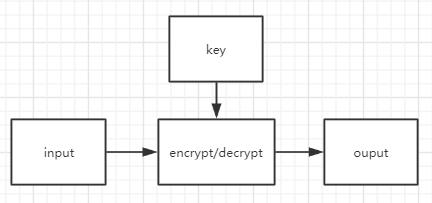

# 
 DES 

- [DES历史简介](#des历史简介)
- [密码学中的一些基础概念](#密码学中的一些基础概念)
   - [对称密钥](#对称密钥)
   - [分组加密](#分组加密)
- [DES整体结构](#des整体结构)
- [DES加密流程](#des加密流程)
   - [生成子密钥](#生成子密钥)
   - [加密过程](#加密过程)

## DES历史简介
数据加密标准(Data Encryption Standard, 缩写为DES), 是一种对称密钥分组加密算法, 于20世纪70年代早期, 由IBM基于Horst Feistel的早期设计开发而来, 之后稍作修改的版本, 于1977年被美国联邦信息处理标准(FIPS)中所采用. DES现在已经不是一种安全加密的方法了, 除非需要向前兼容, 否则不推荐在实际项目中使用.  

## 密码学中的一些基础概念
正如上面的历史简介中提到的, DES是一种对称密钥的分组加密算法, 那么何为对称密钥, 何为分组加密呢?  

#### 对称密钥
使用密钥进行加/解密的算法, 大都可以抽象为下面的图形: 一个信息输入到加密算法中, 再输入对应的密钥, 经过加/解密, 得到输出信息  
  
而当加密和解密, 使用同一个密钥(Key)时, 称为对称加密;   
当加密和解密分别使用不同的密钥(Key)时, 称为非对称加密;    

#### 分组加密
分组加密(block cipher), 顾名思义, 就是每次只能处理一块特定长度的数据分组的加密算法, 就DES来说, 每次只会加密一块长度为64bit的数据, 当数据长于64bit时, 就会将数据切分成一堆长度为64bit的分组, 再输入到算法中进行处理. 但这里就出现了一个问题, 当其他条件不变时, 密钥(Key)相同, 输入块的数据也相同, 此时输出就相同, 而这样做法存在很大的安全漏洞(比如容易寻找规律, 无需破译就能操纵明文等). 所以就存在了分组加密的模式: ECB, CBC, CFB, OFB, CTR等.  

## DES整体结构
DES使用Feistel框架:   
  
* 将输入的64bit块分为各32bit的左右两块
* 在首尾各有一次置换, 称为初始置换(IP)和最终置换(FP), IP, FP互为反函数
* 中间是16轮次的Feistel处理过程, 将右32bit的数据与对应的子密钥输入Feistel函数, 输出的结果与左32bit进行异或(XOR)操作, 结果变为下一轮右32bit块, 而本轮的右32位块直接作为下一轮的左32bit块  

## DES加密流程
这里只讨论DES加密一个64bit块的流程，忽略分组加密模式.  

#### 生成子密钥
子密钥的生成参考DES整体框架图右半边的部分, 主要就是两个置换
* 选择置换1(PC1): 从64bit的密钥中, 取出不是用于奇偶校验的56bit(也可不进行奇偶校验, 直接丢弃那8bit), 进行一一映射, 可理解为调换bit的位置

* 选择置换2(PC2): 从56bit的密钥中, 取出48bit的子密钥, 用于加密函数的输入

#### 加密过程
* 初始置换(IP): 将明文中的64bits, 进行一一映射, 可理解为调换bit的位置

* 将64bit分为左右各32bit, 输入每轮的加密过程中
* 右半边32bit和对应的子密钥输入Feistel函数中, 结果与左32bit进行"异或"操作, 产生的结果作为下一轮的右半边32bit输入, 而本次的右半边直接作为下一轮的左半边32bit输入.  
* Feistel函数, 每轮输入右半边的32bit和对应轮次的子密钥, 进行以下过程:  
   * 扩张: 将32位的半块扩展到48位，其输出包括8个6位的块，每块包含4位对应的输入位，加上两个邻接的块中紧邻的位
   
   * 与密钥混合: 用异或操作将扩张的结果和一个子密钥进行混合
   * S盒: 在与子密钥混合之后，块被分成8个6位的块，然后使用“S盒”，或称“置换盒”进行处理。8个S盒的每一个都使用以查找表方式提供的非线性的变换将它的6个输入位变成4个输出位。S盒提供了DES的核心安全性—如果没有S盒，密码会是线性的，很容易破解
   * 置换: 最后，S盒的32个输出位利用固定的置换，“P置换”进行重组。这个设计是为了将每个S盒的4位输出在下一回次的扩张后，使用4个不同的S盒进行处理
   
* 最终置换(FP): 当进行完16轮的过程之后, 进行最终置换, 最终置换位初始置换的逆过程

#### 具体代码
DES代码网上能很轻易的找到，比如著名的openssl, 如果觉得openssl代码太过复杂, 也可参考[muggleCC](https://github.com/MuggleWei/muggleCC)中的crypt/des代码
