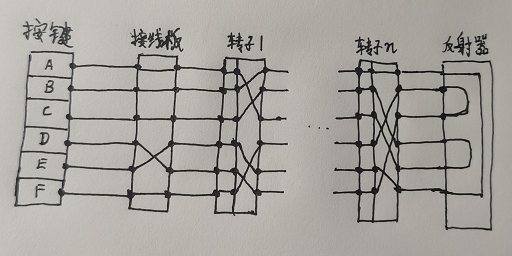

# 
 Enigma 

## Enigma历史简介
恩尼格玛机(Enigma)是一种用于加解密的机械设备, 由德国工程师 Arthur Scherbius 于一战末期发明. 在第二次世界大战中, 广泛的在德军中使用.  

## Enigma加解密
##### Enigma可以简单的分为以下的组件:
* 键盘: 键盘上的每一个字母都有对应的小灯
* 接线板: 接线板上也有字母, 有n条接线, 每条接线负责连接一对字母
* 转子: 圆盘状的装置, 通常是3到4个, 内部有接线, 转子位置不是固定的, 可以按想要的顺序, 放入转子槽当中

##### Enigma抽象表示(简单起见, 只画6个字母):

当在键盘上按下一个字母时:
1. 电信号首先来到接线板, 擦在接线板上的连接线相当于对调了两个字母的位置
2. 接着电信号依次通过n个转子, 每个转子相当于一个简单的替换密码
3. 从最后一个转子输出的电信号到达反射器, 反射器可以理解有这么一个函数: f(f(x)) = x
4. 反射器反射回来的电信号逆向依次通过n个转子
5. 从第一个转子输出的电信号通过接线板到达按键对应的灯泡, 小灯亮起
6. 松开手后, 第一个转子旋转一个刻度, 当第一个转子旋转满一圈后, 会导致第二个转子旋转一个刻度; 依此类推, 第k个转子旋转满一周后, 会导致k+1个转子旋转一个刻度

以上便是Enigma的加解密的过程, 其中主要妙在反射器, 它让整个加密过程和解密过程只需简单的执行同样的操作即可. 可以想象一下, 当两台Enigma机器接线板, 转子设置相同时, 在一次按下键盘的并保持的过程中, 当x输入得到了f(x), 那么f(x)的输入自然就会得到了x.  

##### Enigma机的使用
这里假设Enigma机中有三个转子的槽位  
发送者:
1. 按每日密钥设置机器: Enigma机器的每日密钥表示的是接线板的接线情况, 转子的排列顺序以及初始旋转位置
2. 生成通信密钥: 发送者按照每日密钥设置号Enigma机器, 再随机想出三个字母, 输入两次(之所以输入两次, 是为了防止人为操作失误或者通信中出现了错误)
3. 重置转子旋转位置: 通信密钥中的三个字母, 代表了三个转子初始的旋转刻度, 比如输入了NBA, 便是将三个转子旋转到 N,B,A 的刻度为起始位置
4. 加密信息: 完成了前三步之后, 便可接着加密信息, 最后将加密后的通信密钥和加密后的消息发送出去即可  

接收者:
1. 按每日密钥设置机器
2. 解密通信密钥: 输入接收到的前六个字母, 确认是重复两次的三个字母, 便知道没有错误
3. 重置转子旋转位置: 按照通信密钥重置转子的旋转位置到对应的刻度
4. 接着解密消息即可
